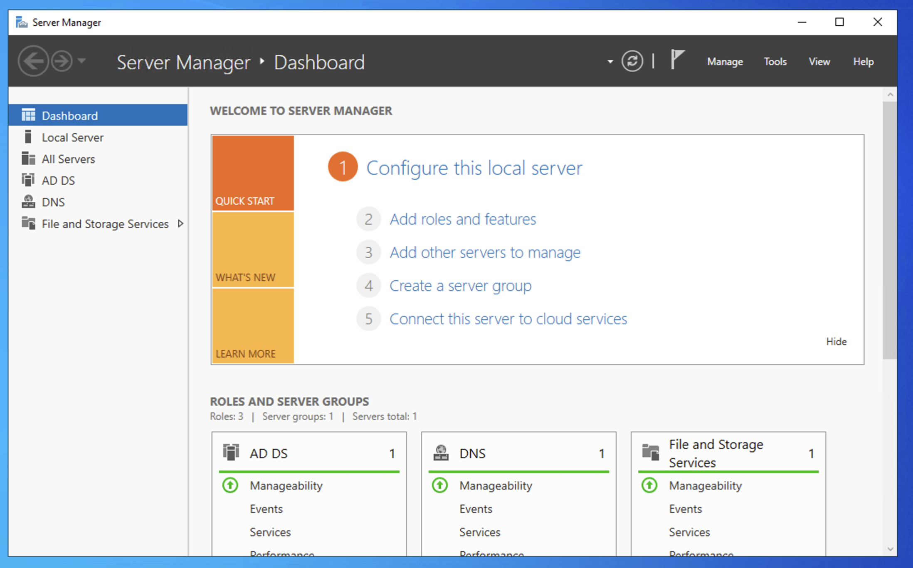
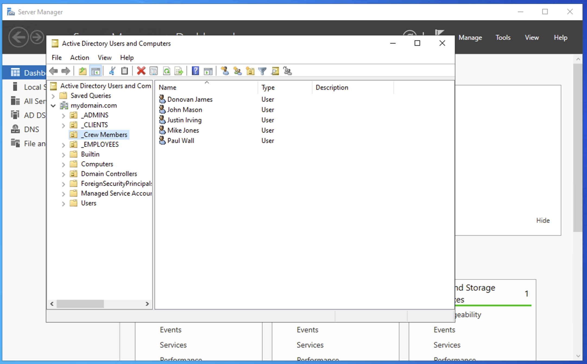
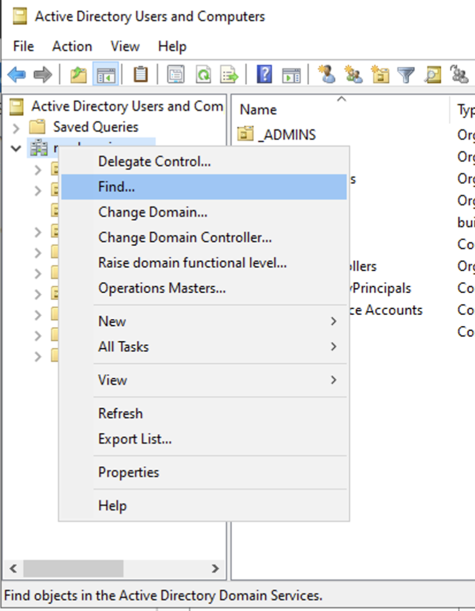
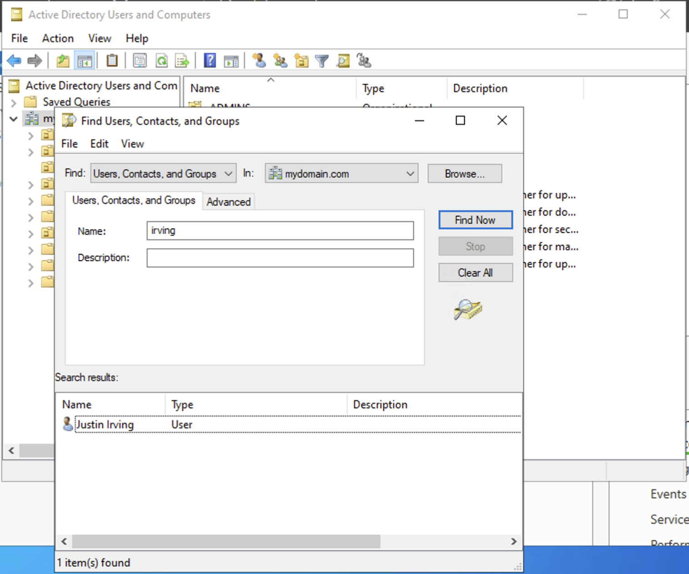

# Active Directory Password Reset Lab

## 📌 Project Overview

This lab demonstrates how to **locate a user account** and **reset a password** using **Active Directory Users and Computers (ADUC)** in a domain environment.  

The lab focuses on practical Active Directory skills for **user account management and password administration**, which are essential for entry-level IT and system administration roles.

---

## 🛠 Technologies & Tools Used

- Active Directory Users and Computers (ADUC)  
- Windows Server  
- Domain Controller  
- Administrative Tools (Server Manager)

---

## 🌍 Environment

- Windows Server (Domain Controller)  
- Active Directory Domain  

---

## 🎯 Skills Demonstrated

- Accessing Active Directory from Server Manager  
- Locating users in the domain  
- Resetting user passwords  
- Configuring password policies (e.g., “User must change password at next logon”)  
- Unlocking user accounts  

---

# 🚀 Lab Steps

---

## 1️⃣ Opening Active Directory Users and Computers

Active Directory Users and Computers is accessed from the server to begin user account management.

**Navigation Path:**  
```
Server Manager → Tools → Active Directory Users and Computers
```

📸 Screenshot:  


---

## 2️⃣ Locating the User Account in the Domain

The domain container (house icon) represents the Active Directory domain where user accounts are stored.  

The **Find** feature is used to quickly locate the target user.

**Navigation Path:**  
```
Right-click domain → Find → Enter username
```

📸 Screenshot:  


---

## 3️⃣ Initiating Password Reset

Once the correct user account is identified, the **Reset Password** option is accessed from the context menu.

**Navigation Path:**  
```
Right-click user account → Reset Password
```

📸 Screenshot:  


---

## 4️⃣ Password Reset Configuration

The password reset dialog allows the administrator to define a new password and apply account options.

**Actions Performed:**

- Enter and confirm a new password  
- Select **User must change password at next logon**  
- Select **Unlock the user’s account** (if applicable)  
- Apply changes  

📸 Screenshot:  


---

# 📊 Lab Outcome

- The user password was successfully reset  
- Account access settings were updated  
- The user can authenticate with the new credentials  
- Practical experience gained in Active Directory password management  

---

# 📚 Key Takeaways

- Navigating ADUC effectively for user account administration  
- Understanding password policies and account options  
- Performing secure password resets and account unlocks  
- Entry-level IT skill development in system administration  

---

# 📌 Future Improvements

- Automate password resets using **PowerShell scripts**  
- Implement bulk password resets for multiple users  
- Track password reset history for auditing and compliance  
- Explore group policy settings for enhanced password security  

---

# 🏁 Conclusion

This lab demonstrates foundational **Active Directory password management skills**, enabling administrators to efficiently manage user account security and authentication.  

It provides practical exposure to locating users, resetting passwords, and applying account policies — key skills for entry-level IT and system administration roles.

---

## 👤 Author

**Gokah William**  
IT & System Administration Professional  
Focused on Active Directory, User Management, and Entry-Level IT Skills
